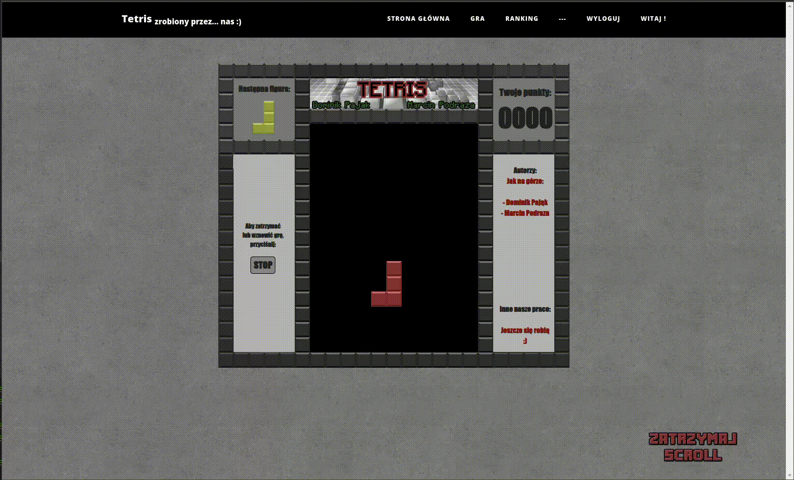
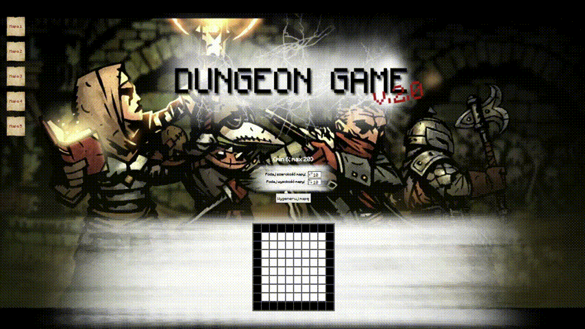
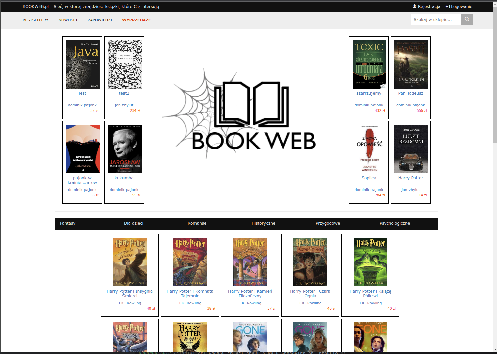
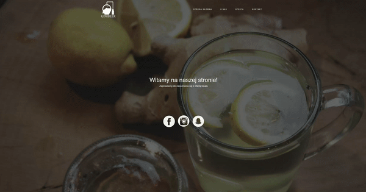

## Archived projects
This codebase is published as a memento of my early days in programming. It's a snapshot of my learning journey and showcases the progress I've made since this initial foray into coding.

<table>
	<tbody width="100%">
	<tr>
		<th>Project</th>	
		<th width="150px">Links</th>
	</tr>
	<tr>
		<td>
         
			<h3>Tetris - School Project (2018)</h3>
			
Tetris game was created as a school project in 2018. It's a simple implementation of the classic puzzle game where blocks fall and must be arranged to clear lines and gain points.

		</td>
		<td>
			

           🔗 <a href="https://github.com/dpajak99/php_tetris/">Github</a>
			

		</td>
	</tr>
	<tr>
		<td>
         
			<h3>Dungeon Game - School Project (2017)</h3>
			
Dungeon Game was created as a school project in 2017. It's a simple implementation of the classic dungeon exploration game where user has to find specific point on the map.

		</td>
		<td>
           

           🔗 <a href="https://github.com/dpajak99/dungeon-game/">Github</a>
			

		</td>
	</tr>
	<tr>
		<td>
         
			<h3>Bookweb - School Project (2017)</h3>
			
This project was developed for a school project in 2017. It is a simple web application that allows users to search for books and add them to their personal library. The application allows to search for books and retrieve information about them.

		</td>
		<td>
           

           🔗 <a href="https://github.com/dpajak99/bookweb">Github</a>
			

		</td>
	</tr>
	<tr>
		<td>
         
			<h3>Ginibeer - School Project (2017)</h3>
			
Project created during internship named "Create your own business". - logo and website are created for a fictional company. The website is a simple presentation page with.

		</td>
		<td>
           

           🔗 <a href="https://github.com/dpajak99/ginibeer">Github</a>
			

		</td>
	</tr>
    <tr>
        <td colspan="2">
            
           <b>Other projects</b> 
            <ul>
                <li>
                    <a href="https://github.com/dpajak99/tarbus-poc">tarbus-poc - Internship project (2020)</a>
                    

                        The tarbus-poc application was developed as part of an internship at SOFTAREA. It shows the actual departure times of buses from a bus stop, using the api of Tarnów Public Transport. In addition, we can check the timetable for a given bus stop and a given line offline, display a list of the nearest bus stops and search for a bus connection online.
                    

                </li>
                <li>
                    <a href="https://github.com/dpajak99/softarea-learning-app">Softarea Learning App - Internship project (2020)</a>
                    

                      An application that supports team and company management. At the moment it allows you to log into the apllication (Local database), create and delete notes.
                    

                </li>
                <li>
                    <a href="https://github.com/dpajak99/jemy-w-tarnowie">Jemy w Tarnowie - Internship project (2020)</a>
                    

                      Unofficial app for <a href="https://www.jemywtarnowie.pl/">Jemy w Tarnowie</a> company. Created for learning purposes.
                    

                </li>
            </ul>
        </td>
    </tr>
	</tbody>
</table>

---

**NOTE** 
*These projects are a documentation of my beginnings in the coding world and is published solely for archival purposes.*
