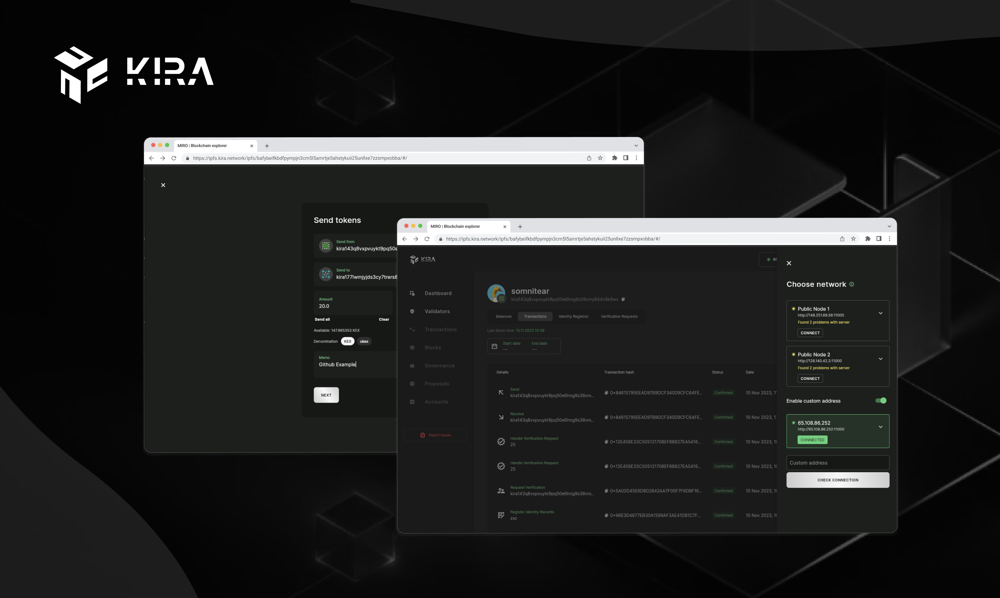
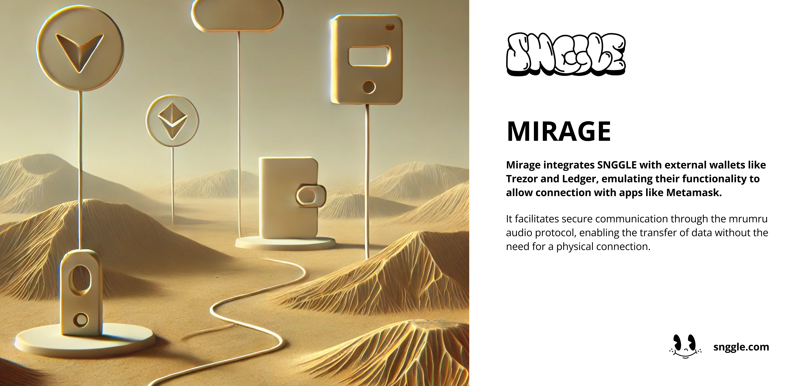
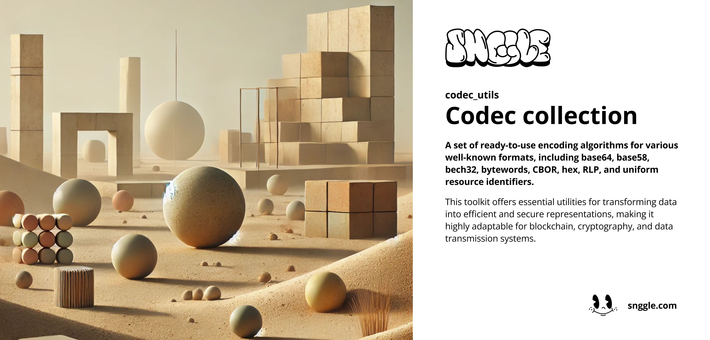
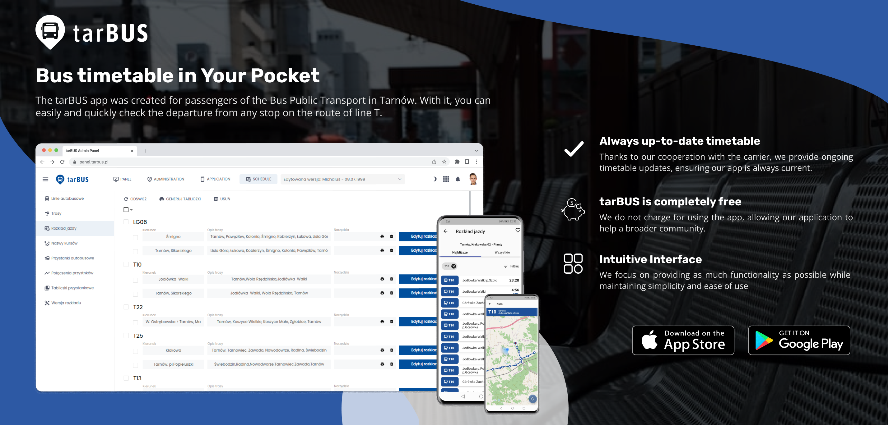
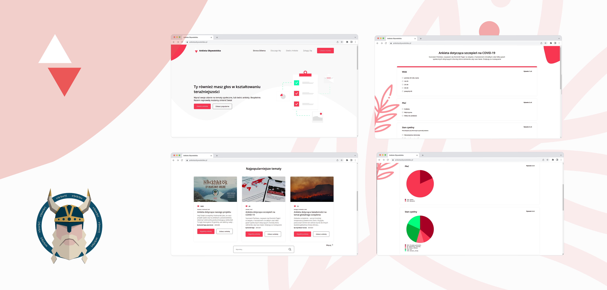

### Hey there, I'm Dominik  a Full Stack Developer with a 4-year track record of excellence in Flutter (Android & iOS) development.

I am a Full Stack Developer and Entrepreneur with a focus on web and mobile app development. My experience includes native Android app development using Java,
as well as cross-platform app development with Flutter.
I am knowledgeable in various database systems, including Mongo and Postgres, frameworks like Spring (Java) and Vue (JS), and blockchain technologies, such as
Ethereum, Solana and Cosmos Network.

Currently, I am leading tarBUS, a startup that grew out of a personal project. My passion extends to open-sourcing and leveraging technology for social good.

#### Education & Achievements:

👨‍💻 BEng. Applied Computer Science  
🎓 University of Applied Sciences in Tarnów  

<table>
	<tbody width="100%">
    <tr>
        <td><b>Skills</b></td>
        <td><b>Tools & Technology</b></td>
    </tr>
    <tr>
        <td valign="top">
            
           ✨ Web and Mobile App Development 
           ✨ Project Management 
           ✨ Blockchain Fundamentals 
           ✨ Database Systems 
           ✨ Team Collaboration Tools 
            
        </td>
        <td valign="top">
           
          ✨ Linux, Ubuntu 
          ✨ Flutter, Dart 
          ✨ Java, Spring, Android 
          ✨ Blockchain: Web3, Etherum, Cosmos, Bitcoin, Solana ecosystem 
          ✨ Github, Gitlab, Bitbucket 
          ✨ Jetbrains environment: DataGrip, InteliJJ, Android Studio 
          ✨ Database: MySQL, PostgreSQL, MongoDB 
          ✨ Tools: Trello, Jira, Notion 
          ✨ Prototyping: Figma, Miro, Excalidraw 
          ✨ Communication: Slack, Discord, Telegram 
           
        </td>
    </tr>
    </tbody>
</table>

### Let's connect!

 

### Featured projects

<table>
	<tbody width="100%">
	<tr>
		<th>Project</th>	
		<th>Links</th>
	</tr>
	<tr>
		<td>
         
			<h3>KIRA Blockchain Explorer (miro)</h3>
			
As a full-stack developer, I'm contributing to the 'Miro' project, a Blockchain Explorer for the <a href="https://kira.network">Kira Network</a>. This tool is designed to provide transparent and real-time insights into transactions, blocks, and validators within the Kira Network. Miro stands out for its ability to navigate the complex data of a decentralized network, offering users an intuitive and comprehensive view of blockchain activities.

			
🗓 November 2021 - Now (~ 2,5 years)

		</td>
		<td>
			

           🔗 <a href="https://kira.network/">Website</a>
           

           

           🔗 <a href="https://github.com/KiraCore/miro">Github</a>
			

		</td>
	</tr>
    <tr>
		<td>
         
			<h3>SNGGLE</h3>
			
As a full-stack developer, I'm contributing to the <a href="https://snggle.com/">SNGGLE</a> project - a first of it's kind hardware security & communication system. It's an entirely off-line mobile application whose purpose is to keep all your inmost secrets safe.

			
🗓 November 2022 - Now (~ 1,5 year)

		</td>
		<td>
			

           🔗 <a href="https://snggle.com">Website</a>
           

           

           🔗 <a href="https://github.com/snggle/snggle">Github</a>
			

		</td>
	</tr>
<tr>
		<td>
         
			<h3>MIRAGE</h3>
			
As a full-stack developer, I'm contributing to the <a href="https://snggle.com/">SNGGLE</a> project - a first of it's kind hardware security & communication system. It's an entirely off-line mobile application whose purpose is to keep all your inmost secrets safe.

			
🗓 November 2021 - Now (~ 2,5 years)

		</td>
		<td>
			

           🔗 <a href="https://snggle.com">Website</a>
           

           

           🔗 <a href="https://github.com/snggle/snggle">Github</a>
			

		</td>
	</tr>
    <tr>
		<td>
         
			<h3>mrumru</h3>
			
As a full-stack developer, I'm contributing to the <a href="https://github.com/snggle/mrumru">mrumru</a> project - audio transmission protocol, which makes safe and convenient way to interact with the world while remaining fully offline.

			
🗓 June 2023 - Now (~ 1 year)

		</td>
		<td>
           

           🔗 <a href="https://github.com/snggle/mrumru">Github</a>
			

		</td>
	</tr>
    <tr>
		<td>
         
			<h3>cryptography_utils</h3>
			
As a full-stack developer, I'm contributing to the <a href="https://github.com/snggle/cryptography_utils">cryptography_utils</a> project - cryptography toolkit implementing BIP-32, BIP-39 (and other) for various known blockchains

			
🗓 December 2023 - Now (~ 0,5 year)

		</td>
		<td>
           

           🔗 <a href="https://github.com/snggle/cryptography_utils">Github</a>
			

		</td>
	</tr>
 <tr>
		<td>
         
			<h3>cryptography_utils</h3>
			
As a full-stack developer, I'm contributing to the <a href="https://github.com/snggle/codec_utils">codec_utils</a> project - cryptography toolkit implementing BIP-32, BIP-39 (and other) for various known blockchains

			
🗓 December 2023 - Now (~ 0,5 year)

		</td>
		<td>
           

           🔗 <a href="https://github.com/snggle/cryptography_utils">Github</a>
			

		</td>
	</tr>
    <tr>
		<td>
         
			<h3>Bus timetable in your pocket (tarBUS)</h3>
			
My original project, of which I'm the owner, Java, Flutter/Dart developer and team leader. The tarBUS app was created for passengers of the <a href="https://gkp.tarnow.pl/">Bus Public Transport</a> in Tarnów (Poland). With it, you can easily and quickly check the departure from any stop on the route of T-lines

			
🗓 December 2020 - 31 October 2023 (~ 3 years)

		</td>
		<td>
			

				
			

			

           
			

			

           🔗 <a href="https://tarbus.pl/">Website</a>
			

		</td>
	</tr>
    <tr>
		<td>
         
			<h3>Ankieta Obywatelska (eng. Citizen survey) - 🥇 2nd place Hackaton project</h3>
			
As a member of the SleipnJs team, I contributed to the creation of the 'Ankieta Obywatelska' project, showcased at <a href="https://hacknarok.pl/">Hacknarök</a> 2021. This platform is designed to generate and collect surveys and petitions on current social issues like ecology, protests, COVID-19, and remote learning and working. It stands out for its verification system that prevents multiple responses from the same user.

			
🗓 28 March 2021 - 29 March 2021 (24 hours)

		</td>
		<td>
           

           🔗 <a href="https://devpost.com/software/sleipnjs-ankieta-wyborcza">Devpost</a> 
           🔗 <a href="https://github.com/SleipnJs/frontend-ankieta-obywatelska">Frontend</a> 
           🔗 <a href="https://github.com/SleipnJs/backend-ankieta-obywatelska">Backend</a>
			

		</td>
	</tr>
	</tbody>
</table>

### Other

📁 [Archived projects](https://github.com/dpajak99/dpajak99/blob/main/PROJECTS_ARCHIVE.md) 
